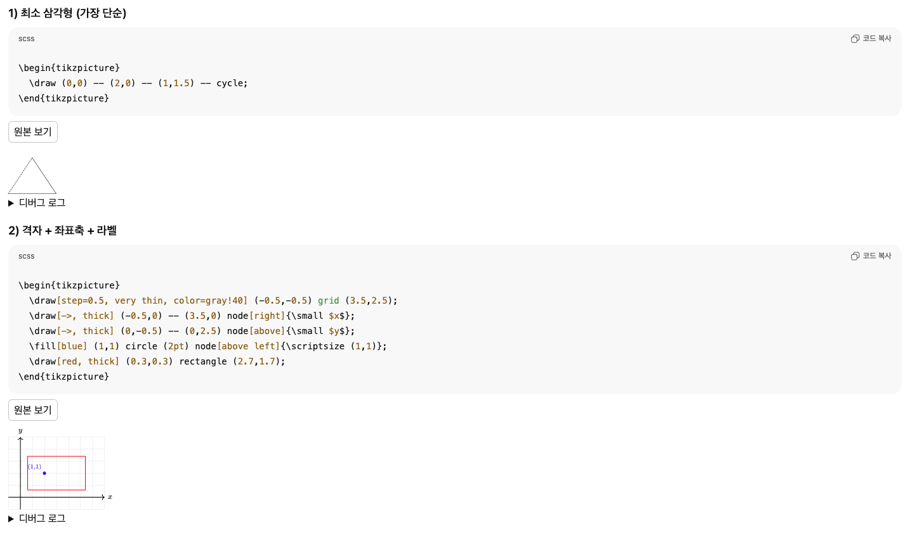
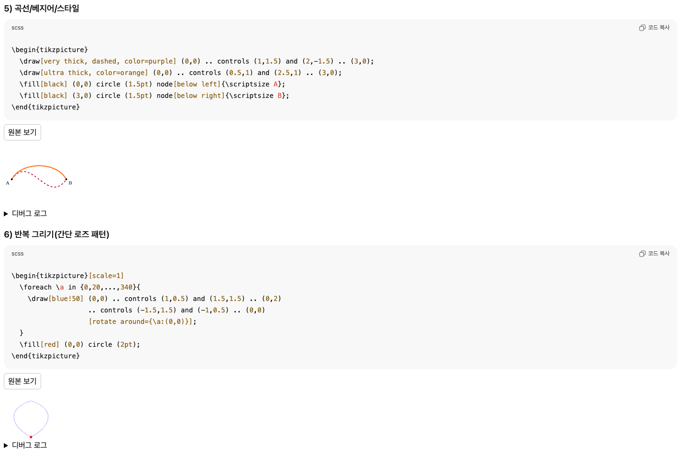

# ChatGPT TikZ Renderer (Chrome MV3) — README

ChatGPT 대화창의 코드블럭(`pre > code`)에 포함된 **TikZ** 스니펫을 **SVG**로 렌더링하는 크롬 확장 프로그램입니다.  
사이트의 CSP(connect-src/script-src) 제약과 WebAssembly 로딩 이슈를 우회하도록 설계되어, **확장 아이콘 한 번 클릭**으로 각 코드블럭 **바로 아래**에 안전하게 렌더링합니다.

---

## ✨ 주요 기능

- `\begin{tikzpicture}...\end{tikzpicture}` 포함 코드블럭 자동 탐지
- 클릭 한 번으로 **MAIN 월드**에 주입 → 각 코드블럭 **아래**에 SVG 삽입
- **CSP 회피**: 렌더링은 확장 오리진(`chrome-extension://…`)의 샌드박스/자식 프레임에서 수행
- **WASM/GZ 로컬화**: 네트워크 차단 없이 **확장 내부 리소스**만 사용
- **UTF-8 안전 `btoa`** 폴리필(한글/이모지 포함 코드 대응)
- 문제 원인 추적을 위한 **디버그 로그**(옵션)

---

## 🧱 폴더 구조

```
chatgpt-tikz/
 ├─ manifest.json
 ├─ background.js
 ├─ renderer.js
 ├─ sandbox_frame.html
 ├─ sandbox_frame.js
 ├─ child_frame.html
 ├─ child_boot.js
 └─ vendor/
    └─ tikzjax/
       ├─ tikzjax.js
       ├─ 3f69afb974a1e83f66a36f7618f88a38c254034b.wasm
       ├─ b565ab0b474e8e557d954694b7379a57db669ac9.gz
       ├─ font.css
       └─ fonts/          # font.css가 참조하는 woff/woff2
```

> ⚠️ `tikzjax.js`가 기대하는 **정확한 파일명**으로 WASM/GZ를 배치해야 합니다.

---

## 🔧 요구 사항

- Chrome 120+ (MV3 권장)
- ChatGPT 웹(https://chatgpt.com 또는 https://chat.openai.com)

---

## 🚀 설치 (개발자 모드)

1. 위 폴더 구조대로 파일을 준비합니다.
2. **WASM/GZ** 파일을 `vendor/tikzjax/`에 위치(파일명 유지):
   - `3f69afb974a1e83f66a36f7618f88a38c254034b.wasm`
   - `b565ab0b474e8e557d954694b7379a57db669ac9.gz`
3. 크롬 주소창에 `chrome://extensions` 입력
4. 우상단 **개발자 모드** ON → **압축해제된 확장 프로그램 로드** → 이 폴더 선택
5. 확장 아이콘이 표시되면 준비 완료

---

## 🧩 Manifest 핵심 (MV3 / CSP)

MV3에서 `unsafe-eval`은 허용되지 않습니다. WebAssembly 실행을 위해 **`'wasm-unsafe-eval'`**을 사용합니다. 또한 Blob Worker 제한을 피하기 위해 `worker-src 'self'`만 사용하고, 코드에서도 **Blob 워커를 생성하지 않습니다**.

```jsonc
// manifest.json (발췌)
{
  "manifest_version": 3,
  "permissions": ["activeTab","scripting","declarativeNetRequest","declarativeNetRequestWithHostAccess"],
  "host_permissions": ["https://chatgpt.com/*","https://chat.openai.com/*","https://s3.us-east-2.amazonaws.com/*"],
  "background": { "service_worker": "background.js" },
  "content_security_policy": {
    "extension_pages": "script-src 'self' 'wasm-unsafe-eval'; worker-src 'self'; style-src 'self' 'unsafe-inline'; img-src 'self' data: blob:; connect-src 'self'; object-src 'self';"
  },
  "web_accessible_resources": [{
    "resources": [
      "sandbox_frame.html",
      "sandbox_frame.js",
      "child_frame.html",
      "child_boot.js",
      "vendor/tikzjax/*",
      "vendor/tikzjax/fonts/*"
    ],
    "matches": ["<all_urls>"]
  }]
}
```

> ✅ 선택 사항: `background.js`는 **DNR(Declarative Net Request)** 규칙으로 모든 `https://s3.us-east-2.amazonaws.com/tikzjax.com/*` 요청을 **확장 로컬**(`chrome-extension://…/vendor/tikzjax/*`)로 리다이렉트하여 놓칠 수 있는 네트워크도 커버합니다.

---

## ⚙️ 동작 흐름

1. **아이콘 클릭** → `background.js`가 MAIN 월드에 구성 주입(`window.__CHATGPT_TIKZ_CONF__`) → `renderer.js` 실행
2. `renderer.js`가 ChatGPT 페이지의 **TikZ 코드블럭**을 수집
3. 확장 오리진의 `sandbox_frame.html`을 숨은 iframe으로 로드하고 렌더 요청 전송
4. `sandbox_frame.js`가 다시 `child_frame.html`(확장 페이지)을 숨은 iframe으로 로드
5. `child_boot.js`가
   - **UTF-8 안전 `btoa`** 폴리필
   - **fetch/XHR 리라이트**: S3 URL → 확장 로컬
   - **`Module.locateFile`**: WASM/GZ 경로를 확장 로컬로 고정
   - TikZ `<script type="text/tikz">` 삽입 후 **외부 파일** `tikzjax.js` 로드
   - 렌더된 `<svg>`를 **포지셔닝 컨테이너**와 함께 부모에 회신
6. `renderer.js`가 **각 코드블럭 아래** 결과 SVG를 삽입

---

## ▶️ 사용법

1. ChatGPT 대화에서 **코드블럭**에 TikZ를 붙여 넣습니다.
   ```
   \begin{tikzpicture}
     \draw (0,0) -- (2,0) -- (1,1.5) -- cycle;
   \end{tikzpicture}
   ```
2. 확장 아이콘 클릭 → 각 코드블럭 **바로 아래** SVG가 나타납니다.

---

## 🧪 테스트용 TikZ

### 1) 최소 삼각형
```
\begin{tikzpicture}
  \draw (0,0) -- (2,0) -- (1,1.5) -- cycle;
\end{tikzpicture}
```

### 2) 한글 라벨(UTF-8 확인)
```
\begin{tikzpicture}
  \draw[thick, blue] (0,0) circle (1);
  \node at (0,0) {\large 안녕하세요!};
  \draw[->, red] (1.2,0) .. controls (2,0.8) .. (2.6,0.2) node[right]{\small 한글 라벨 OK};
\end{tikzpicture}
```

### 3) 격자 + 좌표축
```
\begin{tikzpicture}
  \draw[step=0.5, very thin, color=gray!40] (-0.5,-0.5) grid (3.5,2.5);
  \draw[->, thick] (-0.5,0) -- (3.5,0) node[right]{\small $x$};
  \draw[->, thick] (0,-0.5) -- (0,2.5) node[above]{\small $y$};
\end{tikzpicture}
```

---

## 🩺 트러블슈팅

- **매니페스트 로드 실패 (CSP 관련)**  
  - MV3에서 `unsafe-eval` 또는 `worker-src blob:`는 **허용되지 않습니다**. 위 CSP 예시대로 설정하세요.

- **타임아웃**  
  - `vendor/tikzjax/`에 WASM/GZ/JS가 정확한 파일명으로 존재하는지 확인  
  - `web_accessible_resources`에 관련 경로가 포함되어 있는지 확인

- **SVG가 한 곳에 겹쳐 보임**  
  - 최종 버전은 SVG를 **`position:relative; display:inline-block;` 컨테이너**에 담아 반환합니다. 해당 패치가 반영되어야 합니다.

- **폰트가 어색함**  
  - `font.css`와 `fonts/` 경로가 올바른지, `web_accessible_resources`에 포함되었는지 확인

- **네트워크가 S3로 나가는 것처럼 보임**  
  - 코드 레벨 리라이트 + (옵션) DNR 리다이렉트가 동작해야 합니다. Network 패널에서 실제 요청이 `chrome-extension://…/vendor/tikzjax/*`로 가는지 확인하세요.

---

## 🔐 보안 메모

- 사이트 DOM에는 **완성된 SVG**만 삽입됩니다. 컴파일/렌더는 **확장 오리진**에서 수행됩니다.
- 인라인 스크립트를 사용하지 않고, **외부 JS 파일**만 로드합니다.
- WebAssembly는 **`'wasm-unsafe-eval'`**로만 허용합니다.

---

## 📜 라이선스

- TikZ/PGF, TikZJax 및 사용된 외부 라이브러리의 라이선스를 따릅니다.
- 본 확장 예시는 학습/실험 목적이며, 상용 사용 전 적합성 검토가 필요합니다.

## 구동 화면


